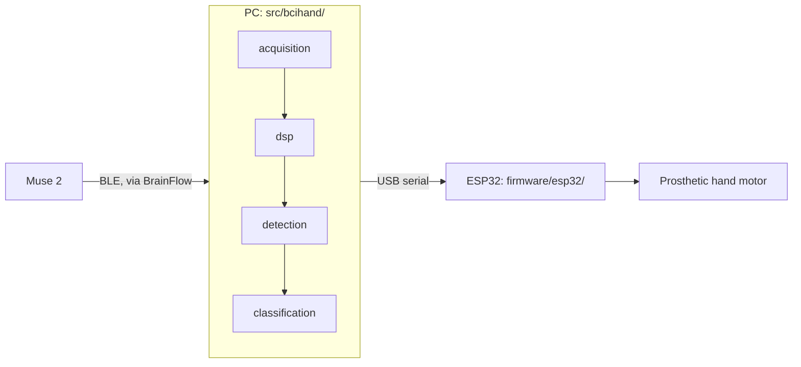

# Muse 2 Blink-Controlled Prosthetic Hand

A biomedical engineering senior-design project: detect intentional eye
blinks — especially fast intentional **double blinks** — from a Muse 2
headband, reliably enough and fast enough to safely control a prosthetic
hand, while rejecting essentially everything that isn't a deliberate blink
(normal EEG, jaw clenching, facial muscle activity, head movement, walking,
electrical interference, baseline drift, electrode noise, random spikes, bad
contact).

**The safe state is always HOLD.** See [docs/SAFETY.md](docs/SAFETY.md).

## BCI Hand Configurator (browser app)

A no-install, browser-based operator UI — connect a Muse 2 and ESP32
directly from Chrome or Edge via Web Bluetooth/Web Serial, calibrate,
watch live detection, and control the hand, all client-side (no account,
no backend, nothing uploaded). See [docs/WEB_APP.md](docs/WEB_APP.md) for
architecture and [docs/LAB_USER_GUIDE.md](docs/LAB_USER_GUIDE.md) for the
5-minute operator walkthrough.

```bash
cd web
npm install
npm run dev          # http://localhost:5173 — development
npm run test          # vitest — includes the Python equivalence test
npm run build          # production build
npm run preview        # serve the production build locally
```

**Deploy**: pushes to `main` auto-deploy to GitHub Pages via
`.github/workflows/deploy-web.yml` (typecheck + test + build must pass
first). See [docs/DEPLOYMENT.md](docs/DEPLOYMENT.md) for one-time setup and
alternatives (Cloudflare Pages / Vercel / Netlify).

**Lab use**: open the deployed URL in Chrome/Edge → Connect Muse 2 →
Calibrate → (optionally) Connect ESP32 → Arm Output → double-blink to
control the hand. Full steps: [docs/LAB_USER_GUIDE.md](docs/LAB_USER_GUIDE.md).

The browser app is a direct, verified port of the Python pipeline below —
not a separate implementation. See
[docs/WEB_DSP_EQUIVALENCE.md](docs/WEB_DSP_EQUIVALENCE.md) for how
`web/src/core/` is checked against real Python output (raw samples
exported from an actual Python run, replayed through the TypeScript
pipeline, asserting the same commands come out), and
[docs/WEB_BLUETOOTH.md](docs/WEB_BLUETOOTH.md) /
[docs/WEB_SERIAL.md](docs/WEB_SERIAL.md) for the verified (not invented)
Muse 2 / ESP32 protocols.

## What actually works right now (Python reference implementation)

Everything below runs today, with no hardware, via the built-in simulator:

```bash
pip install -e ".[dev]"
pytest                                          # 148 tests, all passing
python scripts/run_pipeline.py --source simulate    # full pipeline, prints OPEN/CLOSE/HOLD events
python scripts/visualize.py --scenario demo         # debug plot: raw/filtered signal, threshold, candidates, confidence, command timeline
python scripts/offline_analysis.py --scenario demo  # precision/recall/F1/false-activations-per-minute/latency report
python scripts/calibrate.py --source simulate       # guided calibration -> config/calibration_active.yaml
python scripts/record_data.py --source simulate --out data/raw/demo_session.csv
```

The ESP32 firmware (`firmware/esp32/`) compiles successfully against the
real ESP32 toolchain (verified in this repo's dev environment) but has never
been flashed to physical hardware — see
[docs/TESTING.md](docs/TESTING.md) for exactly what is and isn't verified.

## Architecture



**Mode A** (build/validate first — what this repository actually implements
and tests): `Muse 2 → PC → acquisition → DSP → blink detector → OPEN/CLOSE/HOLD
→ ESP32`. This lets you plot, debug, calibrate, and record data with full
visibility into every stage.

**Mode B** (eventual embedded target, not yet started): `Muse 2 → ESP32 →
DSP → blink detector → hand control`, i.e. everything running on the ESP32
directly. Direct Muse 2 → ESP32 BLE has not been implemented — no BLE GATT
UUIDs, packet formats, or pairing behavior have been fabricated anywhere in
this codebase (see [docs/ESP32_SETUP.md](docs/ESP32_SETUP.md) "Mode B").

See [docs/SIGNAL_PIPELINE.md](docs/SIGNAL_PIPELINE.md) for the detailed
per-stage signal-processing flowchart (filtering → spatial combination →
candidate detection → feature extraction → classification → double-blink
state machine → confidence gate).

## Repository layout

```
config/default_config.yaml   Every tunable constant (see below) — nothing safety/detection-relevant is hard-coded in source
src/bcihand/
  acquisition/                EEGSource abstraction; simulator + BrainFlow (Muse 2) backends
  dsp/                        Causal filters (production) + offline zero-phase filters (visualization only)
  detection/                  Candidate detection, adaptive threshold, features, calibration, signal quality, motion veto
  classification/             Rule-based classifier, double-blink state machine, confidence gate, command mapping
  communication/              PC<->ESP32 serial protocol + link health tracking
  simulation/                 Synthetic Muse-2-like signal generator (12 artifact types + single/double blink)
  analysis/                   Offline precision/recall/F1/false-activations-per-minute/latency metrics
  visualization/              Debug plotting
  utils/                      Config loading, latency profiling, CSV recording
  pipeline.py                 BlinkPipeline — the single real-time entry point, used by both live scripts and every test
firmware/esp32/               ESP32 safety receiver + motor controller (PlatformIO); see docs/ESP32_SETUP.md
scripts/                      CLI entry points (see below)
tests/                        148 automated tests, no hardware required
web/                           BCI Hand Configurator (browser app) — see docs/WEB_APP.md
  src/core/                    Direct port of src/bcihand/, equivalence-tested against it
  src/muse/, src/esp32/         Web Bluetooth / Web Serial clients
  src/worker/, src/engine/       Pipeline worker + the singleton that wires everything together
  src/components/                13-page Betaflight-style UI
docs/                         SIGNAL_PIPELINE, CALIBRATION, ESP32_SETUP, MUSE2_SETUP, TESTING, SAFETY,
                                WEB_APP, WEB_BLUETOOTH, WEB_SERIAL, WEB_DSP_EQUIVALENCE, DEPLOYMENT,
                                LAB_USER_GUIDE, research_review
data/{raw,processed}/         Recordings (gitignored) and analysis outputs
```

## Scripts

| Script | Purpose |
|---|---|
| `scripts/run_pipeline.py` | Mode A driver: acquisition → pipeline → (optional) ESP32 serial link |
| `scripts/calibrate.py` | Guided REST/SINGLE/DOUBLE calibration sequence → `config/calibration_active.yaml` |
| `scripts/record_data.py` | Records a labeled session to CSV (schema in `utils/recorder.py`) |
| `scripts/visualize.py` | Debug plot: raw/filtered signal, adaptive threshold, candidates, confidence, command timeline |
| `scripts/offline_analysis.py` | Precision/recall/F1/**false-activations-per-minute**/latency, from the demo scenario or a recorded CSV |
| `scripts/generate_esp32_filter_coeffs.py` | Regenerates the embedded filter coefficients from the same Python filter design (keeps the ESP32 DSP port numerically in sync) |

All accept `--help` for full options.

## Configuration

Every constant that affects detection, classification, or safety behavior
lives in `config/default_config.yaml` — sample rate, filter cutoffs, notch
frequency, threshold multipliers, blink width bounds, AF7/AF8 agreement
thresholds, double-blink interval bounds, refractory period, confidence
thresholds, motion-veto threshold, communication timeout, heartbeat
interval, and command mapping. Values marked "starting hypothesis" are
unverified defaults pending real calibration data (see
[docs/research_review.md](docs/research_review.md) for the literature these
were derived from, with `NOT VERIFIED` explicitly marked wherever a paper
didn't report a value). `scripts/calibrate.py` writes
`config/calibration_active.yaml`, which is deep-merged on top of the
defaults automatically — no code changes needed to pick up a new
calibration.

## Command mapping

Configurable, not hard-coded (`config.communication.command_mapping`):

- A validated `DOUBLE_BLINK_CONFIRMED` at high confidence → toggles between
  `OPEN` and `CLOSE`.
- A `SINGLE_BLINK_CONFIRMED` is detected, logged, and visible in recordings
  — but presently unmapped (resolves to `HOLD`). See
  [docs/CALIBRATION.md](docs/CALIBRATION.md) for why single blinks aren't
  trusted as a control signal.
- Anything uncertain → `HOLD`.

## Failure modes → HOLD

Classification uncertain, poor signal quality, electrode dropout,
communication lost, heartbeat timeout, invalid command, ESP32 startup/reset
— all resolve to `HOLD`, enforced independently on both the PC and the
ESP32. Full detail: [docs/SAFETY.md](docs/SAFETY.md).

## Connecting hardware (once available)

Two independent paths to the same hardware, either works:

- **Python (this repo's reference implementation)**: `pip install -e
  ".[acquisition]"`, then `--source muse2` on any script for the Muse 2;
  [docs/ESP32_SETUP.md](docs/ESP32_SETUP.md) for the ESP32 (PlatformIO
  build/flash, serial protocol, historical pin configuration).
- **Browser (BCI Hand Configurator)**: no install — Web Bluetooth/Web
  Serial directly from Chrome/Edge. See
  [docs/WEB_BLUETOOTH.md](docs/WEB_BLUETOOTH.md) and
  [docs/WEB_SERIAL.md](docs/WEB_SERIAL.md).

See [docs/MUSE2_SETUP.md](docs/MUSE2_SETUP.md) for the Python-side Muse 2
setup. Neither path has been exercised against physical hardware in this
environment — see [docs/TESTING.md](docs/TESTING.md) for the precise,
non-inflated list of what has and hasn't been verified.

## Development method

This project follows an explicit priority order (not raw accuracy):
**safety → low false-activation rate → double-blink reliability → low
latency → repeatability → embedded feasibility.** Real-time detection uses
only causal, sample-by-sample DSP (no `filtfilt` in the production path — see
`dsp/offline.py`'s clearly-labeled exception for visualization). A double
blink is never merely "two threshold crossings" — every blink independently
passes the full classifier before the timing state machine ever sees it. See
[docs/research_review.md](docs/research_review.md) for the peer-reviewed
basis of the filtering/detection approach, with every unverified number
explicitly marked rather than invented.
