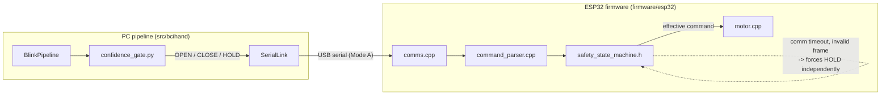

# Safety

This system will eventually drive a physical prosthetic hand. The single
governing rule is:

**The safe state is always HOLD.**

Everything else in this document exists to protect that rule.

## Fail-safe triggers

Both the PC pipeline and the ESP32 firmware independently enforce HOLD on
the following conditions. They are independent on purpose — the PC and the
ESP32 do not trust each other's judgment about when it's safe to move the
hand.

| Condition | PC pipeline | ESP32 firmware |
|---|---|---|
| Startup / reset | `HandStateTracker` starts `UNKNOWN`; no command until a real double blink | `SafetyStateMachine` defaults to `HOLD` (`src/bcihand/…` mirrors `firmware/esp32/lib/core/safety_state_machine.h`) |
| Classification uncertain (medium/low confidence) | `classification/confidence_gate.py: gate_event()` returns `HOLD` | — (PC already gated it) |
| Poor signal quality (flatline / railed / excessive noise) | `detection/signal_quality.py` feeds a hard gate in `blink_classifier.py` and a direct gate in `confidence_gate.py` | — |
| Communication lost | `confidence_gate.gate_event()` checks `comm_ok_provider()` | `SafetyStateMachine::isCommTimedOut()`, checked every `loop()` |
| Invalid/corrupted command | Command mapping never produces anything but `OPEN`/`CLOSE`/`HOLD` | `command_parser.cpp` returns `FrameKind::kInvalid` → `onInvalidFrameReceived()` forces `HOLD` |
| Program exception | Not yet instrumented at the top-level script layer — see **Known gaps** below | ESP32 has no exceptions (C++ embedded, no RTTI/exceptions enabled by default) |

A command other than `HOLD` requires **all** of the following simultaneously,
checked in `classification/confidence_gate.py`:

1. A `DOUBLE_BLINK_CONFIRMED` event (never a single blink — see
   [SIGNAL_PIPELINE.md](SIGNAL_PIPELINE.md)).
2. Confidence ≥ `confidence.high_confidence_threshold` (default 0.80).
3. Signal quality above `confidence.min_signal_quality`, not flatlined, not railed.
4. `comm_ok_provider()` reports the ESP32 link healthy.

Medium confidence is logged (for calibration/tuning) but always resolves to
`HOLD` — there is no "best guess" fallback anywhere in this system.

## Defense in depth: two independent safety layers

If the PC never sent a single frame, or the USB cable is unplugged, or the
PC process crashed mid-loop: the ESP32's own `SafetyStateMachine` times out
(`config.communication.timeout_s`, default 1.5s) and forces `HOLD`
regardless of whatever the last received command was. The PC's own gate
never has to be trusted alone.

## Known gaps (be honest about what is NOT yet covered)

- **PC-side process exceptions**: if `scripts/run_pipeline.py` itself
  crashes (unhandled exception in the main loop), nothing currently sends a
  final `CMD:HOLD` from a signal handler — the `finally:` block in
  `run_pipeline.py` does send `HOLD` on a clean `KeyboardInterrupt`/normal
  exit, but an unexpected hard crash (segfault-class failure, killed
  process) would not run that `finally:` block. In that scenario the ESP32's
  own communication timeout (1.5s) is what actually saves you — this is
  exactly why the ESP32-side safety state machine must never be removed or
  "simplified away," even once the PC side is well-tested.
- **Command mapping is single-blink-blind by design, not oversight**: single
  blinks are real, detected, logged (visible in the visualizer and CSV
  recordings) — but never mapped to a command. See
  [CALIBRATION.md](CALIBRATION.md) for why (a deliberate single blink and a
  spontaneous one look too similar to trust as a control signal on their
  own).
- **Motion veto is a confidence penalty, not a hard veto**, per
  `config/default_config.yaml`'s `motion_veto.confidence_penalty` (default
  0.5). It was deliberately built this way (project brief section 8: "make
  motion rejection configurable so that legitimate blinking while moving is
  not automatically impossible") — but it means a very high-confidence
  blink-like transient during head motion is not automatically rejected,
  only down-weighted. Tune `accel_energy_threshold_g2` and
  `confidence_penalty` against real recorded motion data before trusting
  this in an ambulatory setting.

## Required bench-test order

Never skip a stage. Never test a stage merely because the previous one
compiled — verify its actual output first.

1. **Simulator** — `python scripts/run_pipeline.py --source simulate` (no
   hardware at all).
2. **PC console output** — confirm `OPEN`/`CLOSE`/`HOLD` events and
   `docs`/log output look correct for both simulated and (once available)
   real Muse 2 data.
3. **ESP32 serial output** — flash the firmware, open a serial monitor,
   confirm `DSP_SELF_TEST:PASS`, `STATE:HOLD` on boot, and `ACK:`/`STATE:`
   lines respond correctly to hand-typed `CMD:OPEN` / `CMD:CLOSE` /
   `CMD:HOLD` / `HEARTBEAT` frames — **before** connecting a motor.
4. **LED output** — confirm the status LED reflects `HOLD`/`OPEN`/`CLOSE`
   correctly (see `firmware/esp32/src/diagnostics.cpp`) with no motor
   attached at all.
5. **Motor driver disconnected** — power the ESP32 and motor driver
   separately; confirm PWM/DIR (or servo PWM) signals look correct on a
   multimeter/scope/logic analyzer, still with no motor attached.
6. **Motor without mechanical load** — attach the motor only, unloaded;
   confirm direction and speed are as expected and `HOLD` truly produces
   zero torque (duty cycle 0).
7. **Unloaded hand mechanism** — attach the actual gripper mechanism without
   anything to grip; confirm full range of motion and that `HOLD` mid-travel
   does not creep.
8. **Physical prosthetic-hand testing** — only after every prior stage has
   been independently confirmed.

Every one of stages 3–8 is **WAITING FOR HARDWARE VERIFICATION** in this
repository right now — none of it has been exercised against physical
hardware in the environment this was built in. See
[ESP32_SETUP.md](ESP32_SETUP.md) and [MUSE2_SETUP.md](MUSE2_SETUP.md) for
exactly what has and has not been verified.
