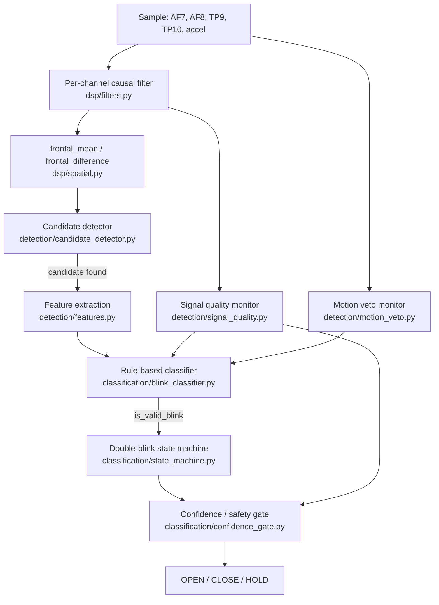

# Signal Pipeline

How a raw Muse 2 sample becomes an `OPEN`/`CLOSE`/`HOLD` command. Every stage
below is a real module in `src/bcihand/`, wired together in
`src/bcihand/pipeline.py::BlinkPipeline.process_sample()` — the exact same
function every automated test in `tests/test_end_to_end_simulation.py` calls,
and the exact same function `scripts/run_pipeline.py` calls per sample,
whether the source is the simulator or (once verified) a real Muse 2.



## 1. Per-channel causal filtering (`dsp/filters.py`)

Each of AF7/AF8 gets its own `CausalBlinkBandFilter`:

1. **Adaptive baseline tracker** — a single-pole exponential moving average
   (`time_constant_s` = `dsp.baseline_tracker_time_constant_s`, default 4s)
   subtracted from the raw signal. This removes DC offset and slow drift
   *without* the phase distortion a hard high-pass corner near DC would add.
2. **Butterworth bandpass** (`dsp.highpass_hz`–`dsp.lowpass_hz`, default
   0.5–20 Hz, order 2), implemented as cascaded second-order sections (SOS)
   with persistent per-instance state (`StreamingSOS`) — causal, sample-by-
   sample, and numerically identical in structure to the embedded C++ port
   (`firmware/esp32/lib/core/dsp.cpp`; see [TESTING.md](TESTING.md)).
3. **Optional 60 Hz notch** (`dsp.notch_hz`, `dsp.notch_quality_factor`) for
   US mains interference.

**Everything here is causal.** `dsp/offline.py` contains a `filtfilt`-based
zero-phase filter explicitly for offline visualization/comparison only — its
functions are named `..._FOR_VISUALIZATION_ONLY` and it is never imported by
`pipeline.py` or any code destined for the ESP32.

The 0.5–20 Hz band is the project brief's "starting hypothesis," refined
against [docs/research_review.md](research_review.md) — see that file's
synthesis section for the reasoning and honest "NOT VERIFIED" markers. It has
**not** been validated against real Muse 2 recordings yet.

## 2. Spatial combination (`dsp/spatial.py`)

- `frontal_mean = (AF7 + AF8) / 2` — the primary signal the candidate
  detector actually runs on. A genuine blink deflects both frontal
  electrodes together, so averaging improves SNR for the shared ocular
  signal while partially cancelling channel-independent noise.
- `frontal_difference = AF7 - AF8` — not used as a blink feature directly,
  but `check_af7_af8_agreement()` uses correlation and amplitude-ratio
  between the raw AF7/AF8 windows to reject single-electrode artifacts
  (dead/noisy electrode, localized spike, bad contact). This agreement check
  is a **hard gate** in the classifier — no amount of amplitude or timing
  correctness can compensate for a failed AF7/AF8 agreement check.

## 3. Candidate detection (`detection/candidate_detector.py`)

A small causal state machine (`BELOW_THRESHOLD` → `ABOVE_THRESHOLD` →
`REFRACTORY`) driven by an adaptive median/MAD threshold
(`detection/adaptive_threshold.py`, robust statistics — see
[CALIBRATION.md](CALIBRATION.md)).

**Filter rebound rejection** is the trickiest part of this module and worth
understanding directly: a causal bandpass filter driven by a blink-shaped
pulse produces a real, sizeable opposite-sign overshoot immediately after the
pulse ends (measured directly on this project's own default filter: a ~90 µV,
180 ms blink pulse produces a ~45–50 µV negative rebound). Two consequences:

- A candidate only *ends* at a zero-crossing (not merely when its magnitude
  drops), so the true blink lobe and its rebound lobe are isolated as
  separate candidates rather than merged into one blob.
- The rebound lobe still crosses the detection threshold and becomes its own
  candidate — expected, and handled explicitly: any candidate whose peak is
  the *opposite sign* of, and starts within `rebound_guard_s` (default 0.30s)
  of, the most recently accepted real candidate is flagged
  `likely_filter_rebound=True` and hard-rejected by the classifier. It gets
  only a minimal debounce (`rebound_refractory_s`, default 0.02s) — not the
  full `refractory_after_candidate_s` — specifically so a genuine fast
  second blink of an intentional double blink isn't masked by the first
  blink's own rebound. This technique follows López-Ahumada et al. 2023's
  "rebound filtering" concept (see
  [research_review.md](research_review.md), Paper 4).

This same rebound logic is also why `detection/calibration.py`'s
`compute_calibration_stats()` explicitly excludes `likely_filter_rebound`
candidates, and why a SINGLE_BLINK calibration trial's stats are taken from
only its single largest-amplitude candidate — see the code comments in that
file for the exact failure mode this fixed (residual filter ringing being
counted as extra blinks and dragging the median amplitude estimate down).

## 4. Feature extraction (`detection/features.py`)

Cheap, `O(window_length)` features only (no FFT, no large matrix ops) so the
same feature set is a plausible ESP32 port: peak amplitude, prominence,
positive/negative excursion, peak-to-peak, duration, rise/fall time, max
slope, area under curve, RMS, signal energy, AF7/AF8 correlation and
amplitude ratio, baseline deviation, and time since the last valid blink.

## 5. Classification (`classification/blink_classifier.py`)

Deliberately **not** a trained model (project brief section 27: filtering +
adaptive thresholds + morphology + channel agreement + artifact rejection,
combined into a bounded confidence score). Hard gates always win over the
soft score:

- Width out of `[min_blink_width_s, max_blink_width_s]`
- `likely_filter_rebound`
- Electrode dropout (flatline) or railing
- Signal quality below `confidence.min_signal_quality`
- Peak prominence below `min_prominence_uv`
- AF7/AF8 correlation below, or amplitude ratio above, the agreement
  thresholds
- Degenerate rise or fall time (a pure ramp/step, e.g. baseline drift
  crossing threshold, has no real rise-then-fall shape)

If every gate passes, a soft confidence score combines signal quality,
AF7/AF8 agreement, and prominence-above-noise-floor via a **geometric mean**
(one weak component drags the whole score down — no averaging-away of a bad
component). An active motion veto multiplies this down further rather than
hard-rejecting (see [SAFETY.md](SAFETY.md) "Known gaps").

This weighting is an explicit engineering judgment call, not derived from a
paper or real user data — it must be revisited once real recordings exist.

## 6. Double-blink state machine (`classification/state_machine.py`)

```
IDLE -> WAIT_FOR_SECOND -> [DOUBLE_BLINK_CONFIRMED] -> REFRACTORY -> IDLE
                        \-> [timeout -> SINGLE_BLINK_CONFIRMED] -> IDLE
```

Every blink fed in here has *already* independently passed the full
classifier — this state machine's only job is timing. A second blink arriving
faster than `double_blink.min_interval_s` (default 0.08s) is treated as
ringing/bounce from the same physical blink and ignored (the machine stays in
`WAIT_FOR_SECOND` for a real second blink, rather than resetting). A second
blink arriving slower than `max_interval_s` (default 0.60s) is too slow to
count — the pending first blink resolves to a `SINGLE_BLINK_CONFIRMED` via
`poll_timeout()` once `wait_for_second_timeout_s` (default 0.70s) elapses.

## 7. Confidence / safety gate (`classification/confidence_gate.py`)

The last stop before a command ever leaves the PC — see
[SAFETY.md](SAFETY.md) for the full HOLD-priority rules.

## Latency

`utils/latency.py`'s `LatencyProfiler` instruments every stage boundary.
Measured on a development machine running the built-in demo scenario
end-to-end (`scripts/run_pipeline.py --source simulate`): total
signal-to-command latency is sub-millisecond (p95 well under 1ms) — the
computational cost of this pipeline is not the bottleneck; real-world
latency will be dominated by Muse 2 BLE transport latency, which is
**WAITING FOR HARDWARE VERIFICATION**.
