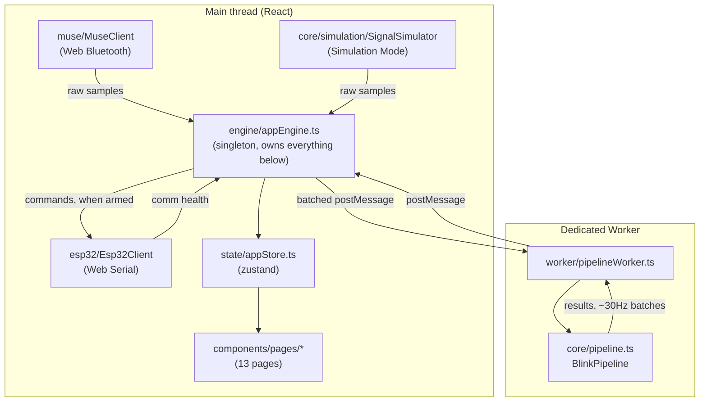

# Web App Architecture

`web/` is the BCI Hand Configurator — a browser-based, no-install operator
UI for the same pipeline `src/bcihand/` implements in Python. Python remains
the trusted reference implementation (see `docs/WEB_DSP_EQUIVALENCE.md`);
this app is a client for the same logic, ported and verified, not a
separate design.

## High-level flow



## Why a Web Worker (project brief section 8)

EEG streams continuously at 256 Hz. Running DSP/candidate-detection/
classification on the UI thread would compete with React's render loop and
risk dropped frames or missed samples under load. `pipelineWorker.ts` owns
the only `BlinkPipeline` instance and runs it on every incoming sample,
batching results and flushing to the main thread at a bounded ~30Hz
(`FLUSH_INTERVAL_MS`) — the detector sees every sample; the UI only ever
sees a display-rate summary. Charts (`components/charts/ScrollingLineChart.tsx`,
a uPlot wrapper) further downsample only for *rendering* — processing itself
is never downsampled.

## Why a single engine singleton, not component-local state

`engine/appEngine.ts` is the only thing that talks to the worker, the Muse
client, and the ESP32 client. React components read `state/appStore.ts`
(zustand) and call engine methods — they never touch the worker or hardware
clients directly. This means "the UI displays the result of the safety
gate, it does not decide whether the hand should move" (project brief
section 25) holds by construction: there is exactly one code path
(`appEngine.maybeForwardCommandToEsp32`) that can ever send a command to a
connected ESP32, and it only runs after `pipelineWorker.ts`'s own
`BlinkPipeline` (the same, equivalence-tested pipeline Python uses) has
resolved a gate decision.

## Directory map

```
web/src/
  core/            Direct port of src/bcihand/ — see docs/WEB_DSP_EQUIVALENCE.md
    dsp/           Causal filters (filterCoeffs.generated.ts is generated, not hand-edited)
    detection/     Candidate detector, adaptive threshold, features, calibration, signal quality, motion veto
    classification/  Rule-based classifier, double-blink state machine, confidence gate, command mapping
    simulation/    Browser port of the Python "one of everything" signal generator
    utils/         Latency profiler, seeded RNG (Simulation Mode only — see docs/WEB_DSP_EQUIVALENCE.md)
    pipeline.ts    BlinkPipeline — the single real-time entry point
    config.ts      BciConfig type + defaults, mirrors config/default_config.yaml
    __fixtures__/  Golden vectors exported from Python, used only by tests
  muse/            Web Bluetooth Muse 2 client — see docs/WEB_BLUETOOTH.md
  esp32/           Web Serial ESP32 client — see docs/WEB_SERIAL.md
  worker/          pipelineWorker.ts + typed message contracts
  engine/          appEngine.ts — the singleton described above
  state/           appStore.ts (zustand), recording.ts (CSV/JSON export), calibrationStorage.ts (localStorage)
  hooks/           useWindowedResults — slices the result ring buffer for charts
  components/
    layout/        Header, LeftNav
    common/        StatusDot, Card, Button, CompatibilityBanner
    charts/        ScrollingLineChart (uPlot)
    pages/         The 13 nav pages
```

## Browser support (project brief section 3)

This is a Chromium-desktop application by design: Web Bluetooth and Web
Serial are both Chromium-only APIs (not implemented in Firefox or Safari as
of this writing). `muse/museClient.ts::checkBrowserCompatibility()` checks
`window.isSecureContext`, `navigator.bluetooth`, and `navigator.serial` at
runtime; `components/common/CompatibilityBanner.tsx` surfaces the result as
a non-blocking banner (Simulation Mode still works everywhere) rather than
crashing or hard-blocking the whole app. The Diagnostics page repeats the
same three checks for troubleshooting.

## State that never leaves the browser

Config presets and calibration are stored in `localStorage`
(`state/calibrationStorage.ts`, `components/pages/Settings.tsx`) — no
account, no backend, nothing uploaded (project brief section 5). Recordings
are held in memory and only ever leave the browser via an explicit
CSV/JSON download the operator triggers.
