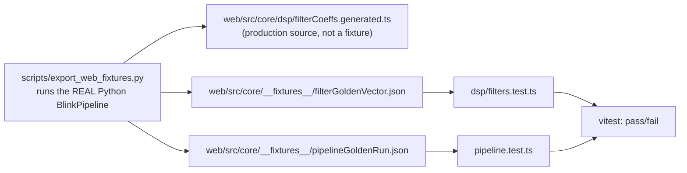

# Web / Python DSP Equivalence

Python (`src/bcihand/`) is the golden reference. Everything in
`web/src/core/` is a direct, deliberate port — not a reimplementation from
first principles — and its correctness is checked automatically against
Python's actual output, not merely assumed from "the code looks similar."

## Why this exists

Per project brief sections 7 and 33: a TypeScript reimplementation of
safety-critical detection logic must not be trusted just because it compiles
and "looks equivalent." A subtle translation bug (wrong operator precedence,
a mismatched array index, a different rounding rule) could silently produce
different blink/double-blink decisions in the browser than in the tested
Python pipeline. This has already happened once during development — see
"A real divergence this caught" below — which is exactly the scenario this
methodology exists to catch.

## How it works



1. **`scripts/export_web_fixtures.py`** runs the actual, tested Python
   `BlinkPipeline` (not a simplified stand-in) against
   `build_demo_scenario()` — the same "one of everything" scenario used by
   `tests/test_end_to_end_simulation.py` — and dumps three files:
   - `dsp/filterCoeffs.generated.ts` — the exact `scipy.signal.butter`/
     `iirnotch` coefficients, as TypeScript source (not test-only data —
     this is what the production filter actually uses at runtime, exactly
     like `firmware/esp32/lib/core/dsp_coeffs.h` on the embedded side).
   - `__fixtures__/filterGoldenVector.json` — a short input/output vector
     for the causal filter chain alone.
   - `__fixtures__/pipelineGoldenRun.json` — the **raw input samples**
     (AF7/AF8/TP9/TP10/accel) from the demo scenario, plus every
     candidate/classification/state-event/command Python produced from
     them.
2. **The raw samples are replayed, not regenerated.** `pipeline.test.ts`
   feeds those exact exported samples into the TypeScript `BlinkPipeline`.
   This is deliberate: the browser's own `SignalSimulator`
   (`core/simulation/signalGenerator.ts`, used for interactive Simulation
   Mode) uses its own PRNG (`utils/rng.ts`, mulberry32 + Box-Muller) that
   does **not** match NumPy's PCG64 bit-for-bit. If the test regenerated
   input independently in JS, a mismatch could mean either "the ports
   diverge" or "the two RNGs disagree" — indistinguishable failures. Using
   Python's actual exported samples as input removes that ambiguity
   entirely: any difference in output is a real behavioral divergence in
   the TypeScript port.
3. **Assertions distinguish discrete from continuous values.** Discrete
   safety-relevant decisions — `widthValid`, `likelyFilterRebound`,
   `isValidBlink`, `rejectionReasons`, `eventType`, and **the final
   command** — are asserted with exact equality. Continuous values
   (confidence, timestamps, the filtered signal itself) are asserted within
   a documented tolerance (`toBeCloseTo(x, 4)` for confidence — 4 decimal
   places on a [0,1] scale; `< 1e-4` absolute for the filtered signal, which
   ranges into the hundreds of µV for artifact events).

## What is actually checked

`web/src/core/pipeline.test.ts`, run via `npm run test` in `web/`:

- Same number of candidates as Python, in the same order.
- Same `widthValid` / `likelyFilterRebound` / `peakSign` / timing for every one.
- Same `isValidBlink` and `rejectionReasons` for every classified candidate.
- Same sequence of state-machine event types (`SINGLE_BLINK_CONFIRMED` /
  `DOUBLE_BLINK_CONFIRMED`), timestamps, and confidence.
- **The same sequence of commands** — this is the actual safety property:
  `["OPEN", "CLOSE"]` and nothing else, matching Python's own
  `test_end_to_end_simulation.py::test_demo_scenario_produces_exactly_two_double_blinks_and_no_other_commands`.
- The filtered frontal signal matches within `1e-4` at every sample.

`web/src/core/dsp/filters.test.ts` separately checks the causal filter
chain alone against a golden vector, matching
`firmware/esp32/lib/core/dsp_golden_vector.h`'s construction so both
embedded ports (C++ and TypeScript) are checked against the same reference
case.

## A real divergence this caught

While building the TypeScript port, `pipeline.test.ts` initially failed on
exactly the safety-relevant assertion it exists to catch: both double
blinks in the demo scenario resolved to `HOLD` instead of `OPEN`/`CLOSE`.
The cause was a key-naming mismatch — `classification/confidenceGate.ts`
looked up the command mapping using Python's snake_case intent strings
(`"double_blink"`), but `core/config.ts`'s `BciConfig` type uses camelCase
field names (`doubleBlink`) for idiomatic TypeScript, so the lookup silently
missed and fell back to `HOLD` every time. Every non-safety-relevant test
(candidate detection, classification, state-machine timing) still passed —
only the final-command assertion caught it. This is the concrete case for
why the equivalence test checks the actual command sequence, not just the
intermediate detection logic.

## Regenerating fixtures

Whenever `src/bcihand/`'s detection/classification logic or
`config/default_config.yaml` changes:

```bash
python scripts/export_web_fixtures.py
cd web && npm run test
```

If the web tests fail after a Python change, that is the equivalence check
doing its job — **fix the TypeScript port to match Python, do not loosen
the test tolerance to make it pass** (the same rule the Python side follows
for its own tests).

## Known gap

`web/src/core/detection/calibration.ts` (the calibration statistics/
threshold-derivation logic) has its own unit tests
(`calibration.test.ts`) but is not yet covered by a Python-fixture
equivalence test the way the main pipeline is — its correctness currently
rests on being a careful line-by-line port (including both correctness
fixes carried over from the Python side — see that file's module
docstring) plus its own passing unit tests, not a golden-vector comparison.
